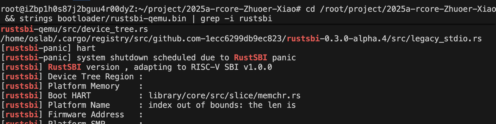
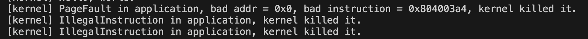

# ch3实验代码
>1.在完成本次实验的过程（含此前学习的过程）中，我曾分别与 以下各位 就（与本次实验相关的）以下方面做过交流，还在代码中对应的位置以注释形式记录了具体的交流对象及内容：  
未与他人交流  
2.此外，我也参考了 以下资料 ，还在代码中对应的位置以注释形式记录了具体的参考来源及内容：
《RUST语言圣经》 、通义千问语法搜索等。  
3.我独立完成了本次实验除以上方面之外的所有工作，包括代码与文档。 我清楚地知道，从以上方面获得的信息在一定程度上降低了实验难度，可能会影响起评分。  
4.我从未使用过他人的代码，不管是原封不动地复制，还是经过了某些等价转换。 我未曾也不会向他人（含此后各届同学）复制或公开我的实验代码，我有义务妥善保管好它们。 我提交至本实验的评测系统的代码，均无意于破坏或妨碍任何计算机系统的正常运转。 我清楚地知道，以上情况均为本课程纪律所禁止，若违反，对应的实验成绩将按“-100”分计。
## 实验设计与代码
### 需求分析
引入一个新的系统调用 ``sys_trace``（ID 为 410）用来追踪当前任务系统调用的历史信息，并做对应的修改。定义如下:
```rust
fn sys_trace(_trace_request: usize, _id: usize, _data: usize) -> isize
```
调用规范：
这个系统调用有三种功能，根据 trace_request 的值不同，执行不同的操作：
如果 trace_request 为 0，则 id 应被视作 *const u8 ，表示读取当前任务 id 地址处一个字节的无符号整数值。此时应忽略 data 参数。返回值为 id 地址处的值。
如果 trace_request 为 1，则 id 应被视作 *mut u8 ，表示写入 data （作为 u8，即只考虑最低位的一个字节）到该用户程序 id 地址处。返回值应为0。
如果 trace_request 为 2，表示查询当前任务调用编号为 id 的系统调用的次数，返回值为这个调用次数。本次调用也计入统计 。
否则，忽略其他参数，返回值为 -1。
### 代码实现
syscall/process.rs已预先定义好实现位置。
针对上述四个需求，可初步得到sys_trace实现：
```rust
pub fn sys_trace(trace_request: usize, id: usize, data: usize) -> isize {
    trace!("kernel: sys_trace");
    match trace_request {
        0=>unsafe {
            let ptr=id as *const u8;
            let value=*ptr;
            value as isize
        },
        1=>unsafe{
            let ptr=id as *mut u8;
            *ptr=data as u8;
            0
        },
        2=>{
            count_syscall(id)
        },
        _=>-1,
    }
}
```
其中，count_syscall函数为获取具体的调用次数结果。为了保存不同的系统调用次数，在task/mod.rs:TaskManagerInner中添加了一个二维数组（本想添加hash表，奈何core中没有实现），目前的系统调用只有5个，但是考虑到后续可能新增系统调用，建立二维数组`syscall_counters: [[usize; MAX_SYSCALL_NUM]; MAX_APP_NUM]`，并在TaskManagerInner增加两个方法，进行更新与检索：
```rust
// 增加计数
pub fn inc_syscall_count(&mut self, task_id: usize, syscall_id: usize) {
        if syscall_id < MAX_SYSCALL_NUM {
            self.syscall_counters[task_id][syscall_id] += 1;
        }
    }
    
/// 获取指定任务的系统调用计数
pub fn get_syscall_count(&self, task_id: usize, syscall_id: usize) -> usize {
    if syscall_id < MAX_SYSCALL_NUM {
        self.syscall_counters[task_id][syscall_id]
    } else {
        0
    }
}
```
对于调用次数的获取，通过在syscall/mod.rs:sys_call进行添加：
```rust
pub fn syscall(syscall_id: usize, args: [usize; 3]) -> isize {
    // 增加系统调用计数
    crate::task::inc_syscall_count(syscall_id);
    
    match syscall_id {
        SYSCALL_WRITE => sys_write(args[0], args[1] as *const u8, args[2]),
        SYSCALL_EXIT => sys_exit(args[0] as i32),
        SYSCALL_YIELD => sys_yield(),
        SYSCALL_GET_TIME => sys_get_time(args[0] as *mut TimeVal, args[1]),
        SYSCALL_TRACE => sys_trace(args[0], args[1], args[2]),
        _ => panic!("Unsupported syscall_id: {}", syscall_id),
    }
}
```
再实现公共函数，这两个函数获取当前执行的任务，并调用任务中对于的方法：
```rust
/// 增加当前任务的系统调用计数
pub fn inc_syscall_count(syscall_id: usize) {
    let mut inner = TASK_MANAGER.inner.exclusive_access();
    let current = inner.current_task;
    inner.inc_syscall_count(current, syscall_id);
}

/// 获取当前任务的系统调用计数
pub fn get_syscall_count(syscall_id: usize) -> usize {
    let inner = TASK_MANAGER.inner.exclusive_access();
    let current = inner.current_task;
    inner.get_syscall_count(current, syscall_id)
}
```
最后实现`count_syscall`:
```rust
pub fn count_syscall(id:usize)->isize{
    crate::task::get_syscall_count(id) as isize
}
```
## 简答作业
### 正确进入 U 态后，程序的特征还应有：使用 S 态特权指令，访问 S 态寄存器后会报错。 请同学们可以自行测试这些内容（运行 三个 bad 测例 (ch2b_bad_*.rs) ）， 描述程序出错行为，同时注意注明你使用的 sbi 及其版本。
SBI相关版本

报错结果：

ch2b_bad_address.rs  
程序尝试访问地址0（空指针），这是一个无效的内存地址
用户态程序没有权限访问这个地址  
ch2b_bad_instructions.rs  
用户态无法访问内核态指令sret
ch2b_bad_register.rs
sstatus是S模式下的特权寄存器，用户态程序无权直接访问
### 深入理解 trap.S 中两个函数 __alltraps 和 __restore 的作用，并回答如下问题:
1.L40：刚进入 __restore 时，sp 代表了什么值。请指出 __restore 的两种使用情景。  
内核栈栈顶；1、内核处理完系统调用后，调用__restore将保存的寄存器状态恢复；  
2、内核进行异常处理后，通过__restore恢复上下文  
2.L43-L48：这几行汇编代码特殊处理了哪些寄存器？这些寄存器的的值对于进入用户态有何意义？请分别解释。
```asm
ld t0, 32*8(sp)
ld t1, 33*8(sp)
ld t2, 2*8(sp)
csrw sstatus, t0
csrw sepc, t1
csrw sscratch, t2
```
sstatus：作用：控制处理器的全局状态和特权级别设置
进入用户态的意义：
设置 SPP 位为 0，表示 sret 执行后将切换到 U 态（用户态）
控制中断使能状态，决定用户态下哪些中断可以触发异常
确保处理器在返回用户态时处于正确的运行状态  
sepc：作用：保存发生异常或执行系统调用时的程序计数器（PC）值
进入用户态的意义：
确定用户程序恢复执行的位置
对于系统调用，通常是下一条指令地址
对于异常处理后返回，是异常发生时的指令地址或处理后的地址  
sscratch：作用：临时存储寄存器，通常用于内核和用户态之间的栈切换
进入用户态的意义：
保存用户态的栈指针（sp）值
支持内核态和用户态之间平滑的栈切换机制
确保返回用户态后能正确使用用户栈
3.L50-L56：为何跳过了 x2 和 x4？
```
ld x1, 1*8(sp)
ld x3, 3*8(sp)
.set n, 5
.rept 27
   LOAD_GP %n
   .set n, n+1
.endr
```
这两个寄存器为：x2寄存器（栈指针寄存器sp）已通过ld t2, 2*8(sp)处理、x4寄存器（线程指针寄存器tp）未使用  
4.L60：该指令之后，sp 和 sscratch 中的值分别有什么意义？
```
csrrw sp, sscratch, sp
```
sp指向用户态的栈空间；sscratch现在保存着内核栈的栈顶地址，为下一次从用户态陷入内核态时的栈切换做准备  
5.__restore：中发生状态切换在哪一条指令？为何该指令执行之后会进入用户态？  
sret，将程序计数器（PC）设置为sepc寄存器的值（程序恢复执行的位置）
根据sstatus寄存器中的SPP位决定切换到哪个特权级别
当SPP=0时，切换到U态（用户态）
同时恢复之前保存的处理器状态  
6.L13：该指令之后，sp 和 sscratch 中的值分别有什么意义？
```
csrrw sp, sscratch, sp
```
将当前sp的值（用户栈指针）写入sscratch寄存器
将sscratch寄存器中原有的值（内核栈指针）读入sp寄存器
7.从 U 态进入 S 态是哪一条指令发生的 ？ 
ecall